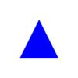
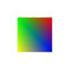
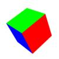
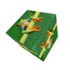
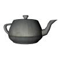

# webgl-test
Test of WebGL Library

|Library                                                |License                                                                      |                                              |                                              |                                              |                                              |                                                   |
|:------------------------------------------------------|:----------------------------------------------------------------------------|:-------------------------------------------------------------------------------:|:-----------------------------------------------------------------------------:|:---------------------------------------------------------------------------:|:------------------------------------------------------------------------------:|:----------------------------------------------------------------------------------:|
|WebGL 1.0                                              |-                                                                            |[Link](https://cx20.github.io/webgl-test/examples/webgl1/triangle/index.html)    |[Link](https://cx20.github.io/webgl-test/examples/webgl1/square/index.html)    |[Link](https://cx20.github.io/webgl-test/examples/webgl1/cube/index.html)    |[Link](https://cx20.github.io/webgl-test/examples/webgl1/texture/index.html)    |[Link](https://cx20.github.io/webgl-test/examples/webgl1/teapot/index.html)         |
|WebGL 2.0                                              |-                                                                            |[Link](https://cx20.github.io/webgl-test/examples/webgl2/triangle/index.html)    |[Link](https://cx20.github.io/webgl-test/examples/webgl2/square/index.html)    |[Link](https://cx20.github.io/webgl-test/examples/webgl2/cube/index.html)    |[Link](https://cx20.github.io/webgl-test/examples/webgl2/texture/index.html)    |[Link](https://cx20.github.io/webgl-test/examples/webgl2/teapot/index.html)         |
|[three.js](https://github.com/mrdoob/three.js/)        |[MIT](https://github.com/mrdoob/three.js/blob/master/LICENSE)                |[Link](https://cx20.github.io/webgl-test/examples/threejs/triangle/index.html)   |[Link](https://cx20.github.io/webgl-test/examples/threejs/square/index.html)   |[Link](https://cx20.github.io/webgl-test/examples/threejs/cube/index.html)   |[Link](https://cx20.github.io/webgl-test/examples/threejs/texture/index.html)   |[Link](https://cx20.github.io/webgl-test/examples/threejs/teapot/index.html)        |
|[Babylon.js](https://github.com/BabylonJS/Babylon.js)  |[Apache v2](https://github.com/BabylonJS/Babylon.js/blob/master/license.md)  |[Link](https://cx20.github.io/webgl-test/examples/babylonjs/triangle/index.html) |[Link](https://cx20.github.io/webgl-test/examples/babylonjs/square/index.html) |[Link](https://cx20.github.io/webgl-test/examples/babylonjs/cube/index.html) |[Link](https://cx20.github.io/webgl-test/examples/babylonjs/texture/index.html) |[Link](https://cx20.github.io/webgl-test/examples/babylonjs/teapot/index.html)      |
|[TWGL.js](https://github.com/greggman/twgl.js)         |[MIT](https://github.com/greggman/twgl.js/blob/master/LICENSE.md)            |[Link](https://cx20.github.io/webgl-test/examples/twgl/triangle/index.html)      |[Link](https://cx20.github.io/webgl-test/examples/twgl/square/index.html)      |[Link](https://cx20.github.io/webgl-test/examples/twgl/cube/index.html)      |[Link](https://cx20.github.io/webgl-test/examples/twgl/texture/index.html)      |[Link](https://cx20.github.io/webgl-test/examples/twgl/teapot/index.html)           |
|[lightgl.js](https://github.com/evanw/lightgl.js/)     |[MIT](https://github.com/evanw/lightgl.js/blob/master/LICENSE)               |[Link](https://cx20.github.io/webgl-test/examples/lightgl/triangle/index.html)   |[Link](https://cx20.github.io/webgl-test/examples/lightgl/square/index.html)   |[Link](https://cx20.github.io/webgl-test/examples/lightgl/cube/index.html)   |[Link](https://cx20.github.io/webgl-test/examples/lightgl/texture/index.html)   |[Link](https://cx20.github.io/webgl-test/examples/lightgl/teapot/index.html)        |
|[litegl.js](https://github.com/jagenjo/litegl.js)      |[MIT](https://github.com/jagenjo/litegl.js/blob/master/LICENSE)              |[Link](https://cx20.github.io/webgl-test/examples/litegl/triangle/index.html)    |[Link](https://cx20.github.io/webgl-test/examples/litegl/square/index.html)    |[Link](https://cx20.github.io/webgl-test/examples/litegl/cube/index.html)    |[Link](https://cx20.github.io/webgl-test/examples/litegl/texture/index.html)    |[Link](https://cx20.github.io/webgl-test/examples/litegl/teapot/index.html)         |
|[picogl.js](https://github.com/tsherif/picogl.js)      |[MIT](https://github.com/tsherif/picogl.js/blob/master/LICENSE)              |[Link](https://cx20.github.io/webgl-test/examples/picogl/triangle/index.html)    |[Link](https://cx20.github.io/webgl-test/examples/picogl/square/index.html)    |[Link](https://cx20.github.io/webgl-test/examples/picogl/cube/index.html)    |[Link](https://cx20.github.io/webgl-test/examples/picogl/texture/index.html)    |[Link](https://cx20.github.io/webgl-test/examples/picogl/teapot/index.html)         |
|[regl](https://github.com/regl-project/regl)           |[MIT](https://github.com/regl-project/regl/blob/gh-pages/LICENSE)            |[Link](https://cx20.github.io/webgl-test/examples/regl/triangle/index.html)      |[Link](https://cx20.github.io/webgl-test/examples/regl/square/index.html)      |[Link](https://cx20.github.io/webgl-test/examples/regl/cube/index.html)      |[Link](https://cx20.github.io/webgl-test/examples/regl/texture/index.html)      |[Link](https://cx20.github.io/webgl-test/examples/regl/teapot/index.html)           |
|[filament](https://github.com/google/filament)         |[Apache v2](https://github.com/google/filament/blob/master/LICENSE)          |[Link](https://cx20.github.io/webgl-test/examples/filament/triangle/index.html)  |[Link](https://cx20.github.io/webgl-test/examples/filament/square/index.html)  |[Link](https://cx20.github.io/webgl-test/examples/filament/cube/index.html)  |[Link](https://cx20.github.io/webgl-test/examples/filament/texture/index.html)  |[Link](https://cx20.github.io/webgl-test/examples/filament/teapot/index.html)       |
|[xeogl](https://github.com/xeolabs/xeogl)              |[MIT](https://github.com/xeolabs/xeogl/blob/master/LICENSE)                  |[Link](https://cx20.github.io/webgl-test/examples/xeogl/triangle/index.html)     |[Link](https://cx20.github.io/webgl-test/examples/xeogl/square/index.html)     |[Link](https://cx20.github.io/webgl-test/examples/xeogl/cube/index.html)     |[Link](https://cx20.github.io/webgl-test/examples/xeogl/texture/index.html)     |[Link](https://cx20.github.io/webgl-test/examples/xeogl/teapot/index.html)          |
|[ClayGL](https://github.com/pissang/claygl)            |[BSD 2-clause](https://github.com/pissang/claygl/blob/master/LICENSE)        |[Link](https://cx20.github.io/webgl-test/examples/claygl/triangle/index.html)    |[Link](https://cx20.github.io/webgl-test/examples/claygl/square/index.html)    |[Link](https://cx20.github.io/webgl-test/examples/claygl/cube/index.html)    |[Link](https://cx20.github.io/webgl-test/examples/claygl/texture/index.html)    |[Link](https://cx20.github.io/webgl-test/examples/claygl/teapot/index.html)         |
|[Hilo3d](https://github.com/hiloteam/Hilo3d)           |[MIT](https://github.com/hiloteam/Hilo3d/blob/master/LICENSE)                |[Link](https://cx20.github.io/webgl-test/examples/hilo3d/triangle/index.html)    |[Link](https://cx20.github.io/webgl-test/examples/hilo3d/square/index.html)    |[Link](https://cx20.github.io/webgl-test/examples/hilo3d/cube/index.html)    |[Link](https://cx20.github.io/webgl-test/examples/hilo3d/texture/index.html)    |Soon                                                                                |
|[PlayCanvas](https://github.com/playcanvas/engine)     |[MIT](https://github.com/playcanvas/engine/blob/master/LICENSE)              |[Link](https://cx20.github.io/webgl-test/examples/playcanvas/triangle/index.html)|[Link](https://cx20.github.io/webgl-test/examples/playcanvas/square/index.html)|[Link](https://cx20.github.io/webgl-test/examples/playcanvas/cube/index.html)|[Link](https://cx20.github.io/webgl-test/examples/playcanvas/texture/index.html)|Soon                                                                                |
|[X3DOM](https://github.com/x3dom/x3dom)                |[MIT and GPL](https://github.com/x3dom/x3dom/blob/master/LICENSE)            |[Link](https://cx20.github.io/webgl-test/examples/x3dom/triangle/index.html)     |[Link](https://cx20.github.io/webgl-test/examples/x3dom/square/index.html)     |[Link](https://cx20.github.io/webgl-test/examples/x3dom/cube/index.html)     |[Link](https://cx20.github.io/webgl-test/examples/x3dom/texture/index.html)     |Soon                                                                                |
|[CZPG](https://github.com/PrincessGod/CraZyPG)         |[MIT](https://github.com/PrincessGod/CraZyPG/blob/master/LICENSE)            |[Link](https://cx20.github.io/webgl-test/examples/czpg/triangle/index.html)      |[Link](https://cx20.github.io/webgl-test/examples/czpg/square/index.html)      |[Link](https://cx20.github.io/webgl-test/examples/czpg/cube/index.html)      |[Link](https://cx20.github.io/webgl-test/examples/czpg/texture/index.html)      |Soon                                                                                |
|[Grimoire.js](https://github.com/GrimoireGL/GrimoireJS)|[MIT](https://github.com/GrimoireGL/GrimoireJS/blob/develop/LICENSE)         |[Link](https://cx20.github.io/webgl-test/examples/grimoirejs/triangle/index.html)|[Link](https://cx20.github.io/webgl-test/examples/grimoirejs/square/index.html)|[Link](https://cx20.github.io/webgl-test/examples/grimoirejs/cube/index.html)|[Link](https://cx20.github.io/webgl-test/examples/grimoirejs/texture/index.html)|Soon                                                                                |
|[GLBoost](https://github.com/emadurandal/GLBoost)      |[MIT](https://github.com/emadurandal/GLBoost/blob/master/LICENSE)            |[Link](https://cx20.github.io/webgl-test/examples/glboost/triangle/index.html)   |[Link](https://cx20.github.io/webgl-test/examples/glboost/square/index.html)   |[Link](https://cx20.github.io/webgl-test/examples/glboost/cube/index.html)   |[Link](https://cx20.github.io/webgl-test/examples/glboost/texture/index.html)   |Soon                                                                                |
|[RedGL](https://github.com/redcamel/RedGL2)            |[MIT](https://github.com/redcamel/RedGL2/blob/dev/LICENSE)                   |[Link](https://cx20.github.io/webgl-test/examples/redgl/triangle/index.html)     |[Link](https://cx20.github.io/webgl-test/examples/redgl/square/index.html)     |[Link](https://cx20.github.io/webgl-test/examples/redgl/cube/index.html)     |[Link](https://cx20.github.io/webgl-test/examples/redgl/texture/index.html)     |Soon                                                                                |
|[Ashes](https://github.com/but0n/Ashes)                |[MIT](https://github.com/but0n/Ashes/blob/master/LICENSE)                    |[Link](https://cx20.github.io/webgl-test/examples/ashes/triangle/index.html)     |[Link](https://cx20.github.io/webgl-test/examples/ashes/square/index.html)     |[Link](https://cx20.github.io/webgl-test/examples/ashes/cube/index.html)     |[Link](https://cx20.github.io/webgl-test/examples/ashes/texture/index.html)     |Soon                                                                                |
|[glCubic](https://github.com/doxas/glcubic.js)         |[MIT](https://github.com/doxas/glcubic.js/blob/master/package.json)          |[Link](https://cx20.github.io/webgl-test/examples/glcubic/triangle/index.html)   |[Link](https://cx20.github.io/webgl-test/examples/glcubic/square/index.html)   |[Link](https://cx20.github.io/webgl-test/examples/glcubic/cube/index.html)   |[Link](https://cx20.github.io/webgl-test/examples/glcubic/texture/index.html)   |Soon                                                                                |
|[XenoGL](https://github.com/kotofurumiya/xenogl)       |[MIT](https://github.com/kotofurumiya/xenogl/blob/master/LICENSE.md)         |[Link](https://cx20.github.io/webgl-test/examples/xenogl/triangle/index.html)    |[Link](https://cx20.github.io/webgl-test/examples/xenogl/square/index.html)    |[Link](https://cx20.github.io/webgl-test/examples/xenogl/cube/index.html)    |[Link](https://cx20.github.io/webgl-test/examples/xenogl/texture/index.html)    |Soon                                                                                |
|[WWG](https://github.com/wakufactory/wwg)              |[WWG](https://github.com/wakufactory/wwg/blob/master/js/WWG.js)              |[Link](https://cx20.github.io/webgl-test/examples/wwg/triangle/index.html)       |[Link](https://cx20.github.io/webgl-test/examples/wwg/square/index.html)       |[Link](https://cx20.github.io/webgl-test/examples/wwg/cube/index.html)       |[Link](https://cx20.github.io/webgl-test/examples/wwg/texture/index.html)       |Soon                                                                                |
|[shree.js](https://github.com/sawa-zen/shree)          |[MIT](https://github.com/sawa-zen/shree/blob/master/LICENSE)                 |[Link](https://cx20.github.io/webgl-test/examples/shreejs/triangle/index.html)   |[Link](https://cx20.github.io/webgl-test/examples/shreejs/square/index.html)   |[Link](https://cx20.github.io/webgl-test/examples/shreejs/cube/index.html)   |[Link](https://cx20.github.io/webgl-test/examples/shreejs/texture/index.html)   |Soon                                                                                |
|[glTips](https://github.com/emadurandal/glTips)        |[CC0](https://github.com/emadurandal/glTips/blob/master/LICENSE)             |[Link](https://cx20.github.io/webgl-test/examples/gltips/triangle/index.html)    |[Link](https://cx20.github.io/webgl-test/examples/gltips/square/index.html)    |[Link](https://cx20.github.io/webgl-test/examples/gltips/cube/index.html)    |[Link](https://cx20.github.io/webgl-test/examples/gltips/texture/index.html)    |Soon                                                                                |
